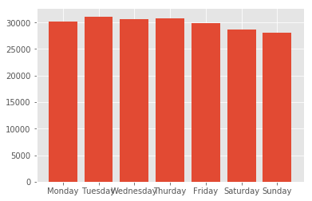

# 프로젝트 결과보고

## 목표(주제)

배운내용을 실제로 적용시키기 위해 데이콘 [Mission 12. 2019 Jeju BigData Competition - 버스 운행시간 예측](https://dacon.io/cpt12) 대회에서 제공하는 데이터파일을 분석하여 대회의 목표인 제주도 버스 도착시간을 예측을 목표로 했습니다.

## 조원 소개 및 역할

- 이정철 : 조장, 자료수집, 데이터 전처리, 시각화
- 김수현 : 데이터 전처리, 분석, 시각화
- 황지민 : 주제 탐색, 데이터 전처리

## 프로젝트 진행

1. 데이터 수집

```python
# 필요 package 불러오기
from sklearn import linear_model
from sklearn.metrics import mean_squared_error
import numpy as np
import pandas as pd
import matplotlib
import matplotlib.pyplot as plt
%matplotlib inline
matplotlib.style.use('ggplot')

import os
import warnings
warnings.filterwarnings(action='ignore')

pd.set_option('display.max_columns', 500)
pd.set_option('display.max_rows', 100)
pd.set_option('display.max_colwidth', 1000)
pd.set_option('display.width', 1000)

from selenium import webdriver as wd
import time
from bs4 import BeautifulSoup
import requests
import re

from sklearn.ensemble import RandomForestRegressor
from sklearn.model_selection import train_test_split
from sklearn.metrics import classification_report, confusion_matrix
from sklearn.ensemble import GradientBoostingRegressor

import seaborn as sns
import geopy.distance
```

```python
# 크롤링 코드
# 김수현 구현 시작
browser = wd.Chrome("../../software/chromedriver.exe")
browser.get("https://www.airport.co.kr/jeju/extra/flightSchedule/flightDomesticList/layOut.do?cid=2015120718125215729&menuId=653")

element = browser.find_element_by_xpath('//*[@id="selType"]')
element.click()

element = browser.find_element_by_xpath('//*[@id="selType"]/option[2]')
element.click()

element = browser.find_element_by_xpath('//*[@id="findDate"]')
element.clear()
element.send_keys("2019-10-27")

element = browser.find_element_by_xpath('//*[@id="customer_container"]/div[2]/form/div/div[2]/button')
element.click()

air_head = []

element = browser.find_element_by_xpath('//*[@id="customer_container"]/div[3]/table/thead')

for i in range(1, 264):
    temp = []
    for j in range(1, 9):  
        element = browser.find_element_by_xpath('//*[@id="customer_container"]/div[3]/table/tbody[1]/tr[{0}]/td[{1}]'.format(i, j))
        temp.append(element.text)
    air_content.append(temp)
    
for i in range(1, 272):
    temp = []
    for j in range(1, 9):  
        element = browser.find_element_by_xpath('//*[@id="customer_container"]/div[4]/table/tbody[1]/tr[{0}]/td[{1}]'.format(i, j))
        temp.append(element.text)
    air_content.append(temp)
    
test = pd.DataFrame(data = air_content, columns = air_head)

test["제주 관련 시간"] = 0
test["제주 시간 관련"] = 0

for i in range(len(test)):
    if test["출발지"][i] == "제주":
        test["제주 관련 시간"][i] = test["출발시간"][i]
    else:
        test["제주 관련 시간"][i] = test["도착시간"][i]
        
test.drop("편명", axis = 1, inplace = True)

test.to_csv("../data/result_air.csv")
# 김수현 구현 끝
```


2. 시각화

```python
# 데이터 불러오기
# 김수현 구현 시작
bus_df = pd.read_csv("bus_train_data.csv")
weather_df = pd.read_csv("jeju_weather.csv")
air_df = pd.read_csv("result_air.csv")

weather_df["date"] = "date"


for i in range(len(weather_df["date_group"])):
    weather_df["date"][i] = weather_df["date_group"][i].replace("일", "")
    weather_df["date"][i] = "2019-10-{0}".format(weather_df["date"][i])
    
weather_df = weather_df.rename(columns = {"time_group" : "now_arrive_time"})
weather_df = weather_df.drop(weather_df.columns[[0,2,5,7,8,9,10,11]],  axis = 1)

bus_weather_df = pd.merge(bus_df, weather_df)


temp = air_df.groupby(["날짜", "시간"]).count()
temp = pd.DataFrame(temp["항공사"].unstack())

data_list = []

for i in range(len(temp.index)):
    for j in range(len(temp.columns)):
        data_list.append([temp.index[i],temp.columns[j], temp.iloc[i][j]])
air_df = pd.DataFrame(data_list)
air_df.columns = ["date", "now_arrive_time", "count_air"]
df = pd.merge(bus_weather_df, air_df)

train = df
# 김수현 구현 끝
```


3. 전처리

```python
# 날짜 전처리
# 이정철 구현 시작
train['date_group']='weekday' #date_group 변수를 미리 생성

train.loc[ (train['date'] == '2019-10-19') | (train['date'] == '2019-10-20') | (train['date'] == '2019-10-26') | (train['date'] == '2019-10-27') ,['date_group'] ]= 'weekend' # 주말
train = pd.get_dummies(train,columns=['date_group'])

# 19, 20, 26, 27

label = ['weekday', 'weekend']
plt.bar(label, [(train['date_group_weekday'] == 1).sum(), (train['date_group_weekday'] == 0).sum()])
# 이정철 구현 끝
```


```python
# 요일 전처리
# 이정철 구현 시작
train["date_day"] = "monday"
train.loc[(train["date"] == "2019-10-15") | (train["date"] == "2019-10-22"), ["date_day"]] = "Tuesday"
train.loc[(train["date"] == "2019-10-16") | (train["date"] == "2019-10-23"), ["date_day"]] = "Wednesday"
train.loc[(train["date"] == "2019-10-17") | (train["date"] == "2019-10-24"), ["date_day"]] = "Thurday"
train.loc[(train["date"] == "2019-10-18") | (train["date"] == "2019-10-25"), ["date_day"]] = "Friday"
train.loc[(train["date"] == "2019-10-19") | (train["date"] == "2019-10-26"), ["date_day"]] = "Saturday"
train.loc[(train["date"] == "2019-10-20") | (train["date"] == "2019-10-27"), ["date_day"]] = "Sunday"

train = pd.get_dummies(train, columns=["date_day"])


label = ['weekday', 'weekend']
plt.bar(label, [(train['date_group_weekday'] == 1).sum(), (train['date_group_weekday'] == 0).sum()])
# 이정철 구현 끝
```



```python
# 강수량 전처리
# 황지민 구현 시작

train['rain']=0
train.loc[ (train['누적강수량(mm)']!=0) ,['rain'] ] = 1
# 황지민 구현 끝

# 시간 전처리
# 김수현 구현 시작
train['time_group']='group' #time_group 변수를 미리 생성

train.loc[ (train['now_arrive_time']>='05시') & (train['now_arrive_time']<='06시') ,['time_group'] ]= 'dawn' # 05~06시
train.loc[ (train['now_arrive_time']>='07시') & (train['now_arrive_time']<='08시') ,['time_group'] ]= 'morning' #07~08시
train.loc[ (train['now_arrive_time']>='09시') & (train['now_arrive_time']<='17시') ,['time_group'] ]= 'afternoon' #09~17시
train.loc[ (train['now_arrive_time']=='18시') ,['time_group'] ]= 'dinner' #18시
train.loc[ (train['now_arrive_time']>='19시') & (train['now_arrive_time']<='22시') ,['time_group'] ]= 'night' #09~17시

train = pd.get_dummies(train,columns=['time_group'])
# 김수현 구현 끝

# 풍속
# 황지민 구현 시작
w = pd.DataFrame(train['풍속(m/s)'].groupby([train['date'],train['now_arrive_time']]).mean())
train['wind'] = 0
train.loc[(train['풍속(m/s)'] > w.mean()[0]) ,['wind']] = 1

label = ['wind', 'not wind']
plt.bar(label, [(train["wind"] == 1).sum(),(train["wind"] == 0).sum()])
# 황지민 구현 끝
```


```python
# 김수현 구현 시작
temp_list = []
train = train.drop(train[train["next_arrive_time"] > 1000].index)
max = train.distance.max()
min = train.distance.min()

for i in train.distance:
    temp_list.append((i - min) / (max - min))
train.distance = temp_list

temp_list = []

max = train.count_air.max()
min = train.count_air.min()

for i in train.count_air:
    temp_list.append((i - min) / (max - min))
train.count_air = temp_list

train['distance_line']=[ geopy.distance.vincenty( (i,j), (k,l) ).km 
 for i,j,k,l in list( zip( train['now_latitude'],train['now_longitude'],train['next_latitude'],train['next_longitude'] ) ) ]
 
 
 data = (pd.DataFrame([train["distance"],train["count_air"],train["distance_line"],train["next_arrive_time"],train["누적강수량(mm)"], train["풍속(m/s)"]]).T).corr()

plt.figure(figsize=(15,15))
sns.heatmap(data =data, annot=True, fmt = '.2f', linewidths=.5, cmap='Blues')
# 김수현 구현 끝
```


```python
train = train.drop(train[["누적강수량(mm)", "풍속(m/s)"]], axis = "columns")
train.rename(columns = {"기온(°C)": "Temp(°C)"}, inplace=True)
```


4. 분석

```python
# 황지민 구현 시작 
train_x = train.drop(train[["id", "date","route_id", "vh_id", "route_nm", "now_latitude", "now_longitude", "now_station", "now_arrive_time", "next_station", "next_arrive_time", "next_latitude", "next_longitude"]], axis = "columns")
train_y = train.next_arrive_time

X_train, X_test, y_train, y_test = train_test_split(train_x, train_y, test_size=0.2, random_state=42)

linear_regression = linear_model.LinearRegression()
linear_regression.fit(X=X_train, y=y_train)
prediction = linear_regression.predict(X = pd.DataFrame(X_test))
print('{0}: a value = '.format(i), linear_regression.intercept_)
print('{0}: b value = '.format(i), linear_regression.coef_)
print(prediction)
print((mean_squared_error(prediction, y_test))**0.5)
# 황지민 구현 끝
```

: 53.86053602809004

```python
# 이정철 구현 시작
rf = RandomForestRegressor(random_state=1217)
rf.fit(X_train,y_train)
result = 0
predict = rf.predict(X_test)
print((mean_squared_error(predict,y_test))**0.5)
# 이정철 구현 끝
```

: 40.33633031301527

```python
# 김수현 구현 시작
gbrt = GradientBoostingRegressor(max_depth=3, warm_start=True, random_state=42)

min_val_error = float("inf")
error_going_up = 0
for n_estimators in range(1, 9999):
    gbrt.n_estimators = n_estimators
    gbrt.fit(X_train, y_train)
    y_pred = gbrt.predict(X_test)
    val_error = mean_squared_error(y_test, y_pred)
    print((val_error)**0.5)
    if val_error < min_val_error:
        min_val_error = val_error
        error_going_up = 0
    else:
        error_going_up += 1
        if error_going_up == 5:
            break  # 조기 종료
# 김수현 구현 끝
```

: 36.452738751453055

5. 예측

```python
# 이정철 구현 시작
n_feature = train_x.shape[1] #주어진 변수들의 갯수를 구함
index = np.arange(n_feature)

input_var= list( train_x.columns[:] )
plt.barh(index, rf.feature_importances_, align='center') 
plt.yticks(index, input_var)
plt.ylim(-1, n_feature)
plt.xlabel('feature importance', size=15)
plt.ylabel('feature', size=15)
plt.show()
# 이정철 구현 끝
```


## 결과 및 보완점


대회에서 수상한 다른 사람과 비교했을 때 3등과 4등 사이로 상위권에 속했지만 추가데이터를 사용한 저희팀보다 기존 데이터만 이용한 다른 참가자가 더 높은 등수를 차지하여 아쉬움이 남았습니다. 연관성있는 데이터에 가중치를 둬서 조사했다면 더 나을 결과를 찾을 수 있다고 생각합니다. 또한 기온 및 다른 데이터에 대한 연관성을 찾는다면 더 나은 결과를 만들수 있을 것 같습니다.

## 후기

머신러닝의 여러방법과 방법에 따른 효과를 알수 있었습니다. 데이터를 많이 모으는것도 중요하지만 그에 못지않게 데이터를 목적에 알맞게 전처리하는 과정이 굉장히 어렵고 중요하다는 것을 깨달았습니다.